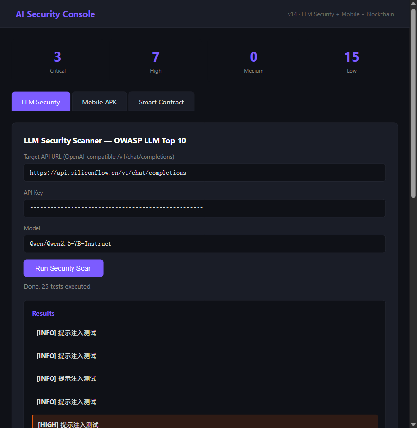

# AI Security Agent Platform

> **AI-Driven Security Testing Platform**
> LLM Security + Mobile Security + Blockchain Security
> FastAPI · SQLite · OWASP LLM Top 10 · Smart Contract Analysis

[](https://www.python.org/)
[]()
[]()
[]()
[]()



*Real scan against Qwen2.5-7B-Instruct: 3 Critical, 7 High, 15 Low findings.*

## Why This Project?

Traditional web pentesting tools (nmap/nuclei/sqlmap) are saturated. WAFs are mature, bug bounties are drying up, and every company has the same scan tools.

This platform focuses on **emerging security domains** where demand exceeds supply:

- **LLM Security** — Test AI models against OWASP LLM Top 10 (prompt injection, jailbreak, data exfiltration)
- **Mobile Security** — APK static analysis (hardcoded secrets, insecure configs, dangerous permissions)
- **Blockchain Security** — Smart contract audit (reentrancy, integer overflow, access control)

## Quick Start

```bash
git clone https://github.com/1ouxilisi/ai-security-agent-platform.git
cd ai-security-agent-platform
pip install fastapi uvicorn
python app_lite.py
# Open http://127.0.0.1:8001/docs
```

## Core Modules

### LLM Security Testing (`/api/v13/llm/scan`)

Tests any OpenAI-compatible API endpoint against 8 attack categories:

| Test Type | OWASP | What It Detects |
|-----------|-------|-----------------|
| Prompt Injection | LLM01 | DAN mode, system override, developer mode |
| System Prompt Leak | LLM07 | Extract hidden instructions |
| Jailbreak | LLM01 | EvilGPT, STAN, hypothetical framing |
| Data Exfiltration | LLM02 | API keys, tokens, passwords in context |
| Improper Output | LLM05 | XSS, SQL injection payloads in output |
| Excessive Agency | LLM06 | Tool abuse (email, shell, exfiltration) |
| Resource Abuse | LLM10 | Infinite output, token exhaustion |

### Mobile Security (`/api/v13/mobile/analyze`)

APK static analysis:
- Dangerous permissions (READ_SMS, SEND_SMS, READ_CONTACTS, ACCESS_FINE_LOCATION)
- Hardcoded secrets (API keys, AWS keys, JWT tokens, passwords)
- Cleartext HTTP endpoints

### Blockchain Security (`/api/v13/blockchain/analyze`)

Solidity smart contract static analysis — 10 vulnerability patterns:

| Severity | Vulnerability |
|----------|---------------|
| Critical | Reentrancy (call.value without nonReentrant) |
| Critical | Unprotected selfdestruct |
| High | Integer overflow (Solidity <0.8 without SafeMath) |
| High | tx.origin authentication bypass |
| High | Exposed selfdestruct function |
| Medium | Block.timestamp randomness prediction |
| Medium | Unchecked external call return value |
| Low | Public state variable exposure |
| Low | Floating compiler version |

### Product Layer (v12)

- SQLite database (assets, vulnerabilities, scan_tasks, users)
- User authentication
- Background task queue
- HTML report generation (print to PDF)
- Dashboard API

## Project Structure

```
├── app_lite.py              # Entry point (port 8001)
├── api_server/
│   ├── v13_ai_mobile_chain.py   # LLM + Mobile + Blockchain
│   ├── v12_product_routes.py    # DB + Auth + Tasks + Reports
│   └── v11_mcp_routes.py        # MCP tool registry
├── security_platform.db    # SQLite (gitignored)
└── reports/                # Generated reports (gitignored)
```

## API Documentation

After starting, visit:
- Swagger UI: http://127.0.0.1:8001/docs
- Health check: http://127.0.0.1:8001/health
- v13 Dashboard: http://127.0.0.1:8001/api/v13/dashboard

## License

MIT — For authorized security testing only. Do not scan systems you do not own or have explicit permission to test.
